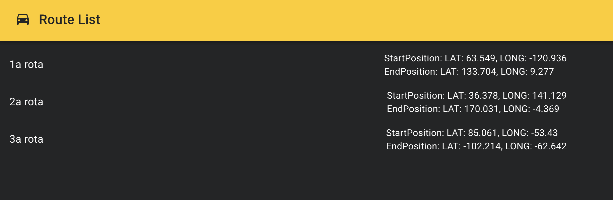

# imersao-fsfc2-desafio2


<!-- BADGES -->
<p align="center">
  
  
  
  
  
  <a href="https://www.linkedin.com/in/abilioazevedo/">
    
  </a>
</p>
<br/>

<!-- PROJECT LOGO -->
<p align="center">
  <a href="https://github.com/kibolho/imersao-fsfc2-desafio2">
     
  </a>
</p>

***

<!-- TABLE OF CONTENTS -->
# Table of Contents
- [imersao-fsfc2-desafio2](#imersao-fsfc2-desafio2)
- [Table of Contents](#table-of-contents)
- [:boom: About The Project](#boom-about-the-project)
  - [Description](#description)
- [:gear: Built With](#gear-built-with)
  - [Tools](#tools)
  - [Technologies](#technologies)
- [:rocket: Getting Started](#rocket-getting-started)
  - [:zap: To RUN](#zap-to-run)
  - [Desafio 3 - Deploy no Kubernetes](#desafio-3---deploy-no-kubernetes)
    - [Informações do desafio](#informações-do-desafio)
- [:bulb: Contributing](#bulb-contributing)
- [:memo: License](#memo-license)
- [:e-mail: Contact](#e-mail-contact)
- [:exclamation: Acknowledgements](#exclamation-acknowledgements)
<!-- * [Usage](#usage)
* [Roadmap](#arrows_clockwise-roadmap) -->

<!-- ABOUT THE PROJECT -->
# :boom: About The Project

<!-- Project image -->
<!--  -->


## Description
This is a docker container with NEST.JS Backend and React.JS Front-End that list routes.

# :gear: Built With
  ## Tools
  * [VSCode](https://code.visualstudio.com/)

  ## Technologies
  * [Javascript](https://developer.mozilla.org/pt-BR/docs/Learn/JavaScript)
  * [Node.js](https://nodejs.org/)
  * [NEST.js](https://nestjs.com/)
  * [React.js](https://reactjs.org/)

  [:arrow_up: Back to top](#table-of-Contents)


<!-- GETTING STARTED -->
# :rocket: Getting Started

To get a local copy up and running follow these simple steps.

[:arrow_up: Back to top](#table-of-Contents)


## :zap: To RUN
Run the commands below to install and run the app.
  ```sh
    #Clone the project
    git clone https://github.com/kibolho/imersao-fsfc2-desafio3
  ```

  ```sh
      docker-compose up -d
   ```

[:arrow_up: Back to top](#table-of-Contents)

## Desafio 3 - Deploy no Kubernetes

### Informações do desafio
Nesse desafio, você deverá gerar os manifestos yaml do Kubernetes (deployment e service) para o backend e o frontend que criados no desafio 2.

Você NÃO precisa utilizar um Cloud Provider como AWS, GCP e Azure para realizar essa tarefa. Você pode realizar localmente a instalação do cluster utilizando o Kind (https://kind.sigs.k8s.io/).

Crie uma pasta chamada k8s no seu repositório do github (utilizado no desafio anterior) e informe no campo abaixo.

[:arrow_up: Back to top](#table-of-Contents)

<!-- CONTRIBUTING -->
# :bulb: Contributing

Any contributions you make are **greatly appreciated**.

1. Fork the Project
2. Create your Feature Branch (`git checkout -b feature`)
3. Commit your Changes (`git commit -m 'Add some Feature'`)
4. Push to the Branch (`git push origin Feature`)
5. Open a Pull Request

[:arrow_up: Back to top](#table-of-Contents)

<!-- USAGE EXAMPLES -->
<!-- # Usage

Use this space to show useful examples of how a project can be used. Additional screenshots, code examples and demos work well in this space. You may also link to more resources.

_For more examples, please refer to the [Documentation](https://example.com)_ -->


<!-- LICENSE -->
# :memo: License

Distributed under the MIT License. See [LICENSE](LICENSE.md) for more information.

[:arrow_up: Back to top](#table-of-Contents)


<!-- CONTACT -->
# :e-mail: Contact

Abílio Azevedo - <me@abilioazevedo.com.br>

LinkedIn - <https://www.linkedin.com/in/abilioazevedo/>

[:arrow_up: Back to top](#table-of-Contents)


<!-- ACKNOWLEDGEMENTS -->
# :exclamation: Acknowledgements

[:arrow_up: Back to top](#table-of-Contents)


